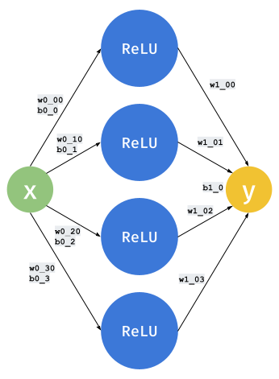

## Neural Networks: Origami in the Shape of Data

--

## Basics: Modeling

- Models are used to predict things
- They learn from data
- Input (features): n numbers
- Output (targets): m numbers

--

## Setup & Simplifications

- Section 1: `x -> y`
- Section 2: `(x0, x1) -> y`
- Section 3: `(x0, x1, x2) -> (x0, x1, x2)`

---

## NN's Building Block: ReLU

- a.k.a. the "activation" or "nonlinearity"
    - `ReLU(x) = max(x, 0)`
- A "Neuron" is a tunable `ReLU`:
    - `y = ReLU(w*x + b)`
    - `w` and `b` are freely tunable
- The effect: straight lines get folded once

[Play!](viz/00-relu.html)

--

## Two Neurons = Two Folds

- Multiple neurons can be added up
    - 2 neurons: `y = ReLU(w0*x + b0) + ReLU(w1*x + b1)`
- 2 knobs to be tuned
- 2 folds to be created
- Also shown:
    - fake data points with prediction error
    - approx. number of folds, or knee points

[Play!](viz/01-2relus.html)

--

## More Neurons = More Folds

- More knobs to be tuned
- More folds to be created
- Still not flexible to output negative numbers

[Play!](viz/02-4relus.html)

--

## Simplest NN: Perceptron

- 4 hidden neurons, creates 4 folds
- Aggregation now tunable: outputs can be negative now

[Play!](viz/03-nn1x4.html)

--

## Widening the Perceptron

- 12 hidden neurons: 12 folds
- More ways to fold a line into the shape of data
- Widening the hidden layer to ∞
    => Universal Approximation Theorem

[Play!](viz/04-nn1x12.html)

--

## Adding More Layers

- 2 hidden layers with 6 neurons each: still 12 folds
- Little qualitative difference vs. Perceptron

[Play!](viz/05-nn2x6.html)

--

## Keep Deepening

- 4 hidden layers with 3 neurons each
- More "expressive" yet also more "inhibited"

[Play!](viz/06-nn4x3.html)

--

## Even Deeper

- 6 hidden layers with 2 neurons each
- High chance of inhibition
- High chance of sharp folds

[Play!](viz/07-nn6x2.html)

---

## 2D Input

- NNs get to make creases on "a sheet of paper"
- 2 hidden layers with 6 neurons each

[Play!](viz/08-input2d-nn2x6.html)

--

## 2D Input with Deeper NN

- 4 hidden layers with 3 neurons each
- Similar effect of deepening

[Play!](viz/09-input2d-nn4x3.html)

--

## Toy Transformer

- Single transformer block
- ReLU not needed since Attention is All You Need
- 2D input treated as sequences
- Hard creases -> smooth curls

[Play!](viz/10-input2d-transformer1.html)

--

## Deeper Transformer

- 5 Transformer blocks
- Lots of knobs to tune
- Very expressive yet inhibitive folds

[Play!](viz/11-input2d-transformer4.html)

---

## 3D Autoregressive Model

- 3D space modeling
- Autoregressive behavior
- [Add more key points here]

[Play!](viz/12-autoregressive3d.html)

--

## Stochastic Autoregressive Model

- Stochastic behavior
- Randomness in models
- [Add more key points here]

[Play!](viz/13-stochastic-autoregressive3d.html) 